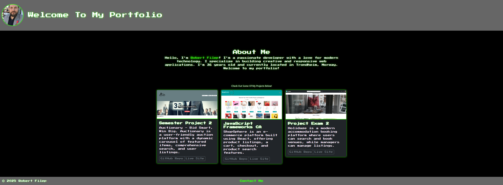

## Portfolio 2 - Developer Portfolio



A modern, responsive developer portfolio showcasing projects, documentation, and a personal profile with a retro neon aesthetic.

---

## Description

This project is a professional developer portfolio that documents three key projects and includes:

- A detailed README for each project (Semester Project 2, JavaScript Frameworks CA, and Project Exam 2)
- A personal GitHub profile README
- A responsive portfolio webpage built with React and Bootstrap featuring project cards with animations, sound effects, and interactive elements.

**Key Features:**

- **Project Documentation:** Clear instructions and details for each project.
- **Animated UI Elements:** Projects cards with hover effects, fireworks animations, and sound effects.
- **Responsive Design:** A fully responsive layout that works on both desktop and mobile.
- **Retro Neon Theme:** Custom styling with a pixel art and neon green aesthetic.

---

## Built With

- **React.js**
- **Bootstrap**
- **Framer Motion** (for animations)
- **Canvas-Confetti** (for fireworks effects)
- **EmailJS** (for the contact form)

---

## Getting Started

### Installing

1. **Clone the repository:**

   ```bash
   git clone git@github.com:robfil50219/portfolio-2.git
   ```
